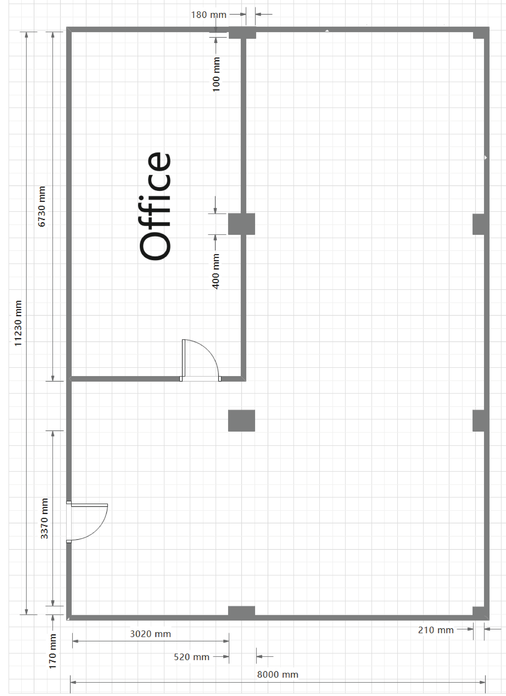
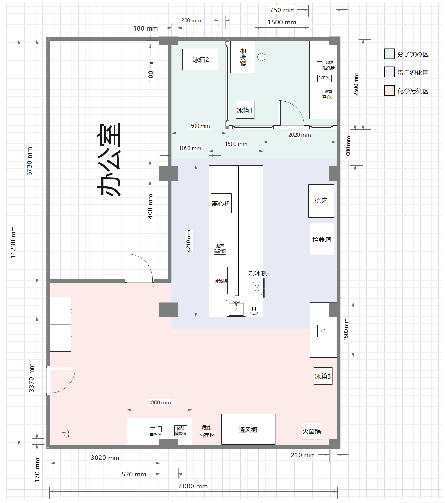

# Laboratory Design Concept

### Laboratory Layout Overview
The laboratory covers an area of 68 square meters in an "L"-shaped layout, as shown in Figure 1.
<figure>
  
  <figcaption align="center"><i>Figure 1: Original Lab Layout</i></figcaption>
</figure>

### Project Overview and Requirements Analysis
This project aims to engineer nitrilase through directed evolution and rational design to achieve highly efficient asymmetric hydrolysis of specific trifluoromethyl-containing racemic complex cyanohydrins into target fluorinated chiral carboxylic acids.

Based on this catalytic objective, the core process workflow of the platform can be broken down into the following five steps:

1. **In silico Design and Preparation:** Sequence screening and optimization based on computational biology, followed by customized plasmid synthesis.
    
2. **Upstream Strain Construction:** Competent cell preparation, plasmid transformation, glycerol stock preservation, and plate spreading.
    
3. **Midstream Expression and Purification:** Strain propagation (shake-flask fermentation), induced expression of the target protein, cell disruption, and downstream purification.
    
4. **Activity and Biochemical Characterization:** Protein concentration and purity verification (SDS-PAGE), and enzyme activity assays.
    
5. **Data Feedback and Iteration:** Verification of experimental data and molecular docking results to guide the next round of in silico optimization.

Considering the process workflow logic above, the spatial layout strictly adheres to the physical isolation principle based on "contamination level and hazard index." From the inside out, the space is divided into: a high-cleanliness molecular biology isolation area, a routine protein preparation area, and a chemical contamination area equipped for handling high-risk chemicals.

### Design Concept for the Upstream Molecular and Aseptic Operation Area
Positioned as the core physical isolation zone for the upstream workflow of enzyme engineering, this area primarily handles key operations requiring strict aseptic conditions, such as plasmid transformation, microbial plating, strain activation, and PCR amplification. To completely prevent bioaerosol contamination potentially generated by mid-to-downstream biochemical purification, this area features a systematic anti-contamination and micro-workflow design:

- **Physical Isolation and Aseptic Barrier:** An independent cleanroom is constructed using full glass partitions for spatial hard isolation. A clean bench is placed within the area to provide dual aseptic assurance via local laminar flow, ensuring strain transfer and PCR setup remain free from environmental microbes and nucleic acid cross-contamination.

- **Internal Circulation of High-Frequency Reagents (Micro-workflow Closed Loop):** To strictly maintain the clean zone barrier and minimize disruption to the sterile airflow caused by personnel frequently opening doors, a 4°C/-20°C dual-temperature refrigerator is located nearby within the area. This enables the closed-loop storage and flow of core reagents (e.g., primers, plasmids) and transformation plates requiring growth retardation strictly within the cleanroom.

- **Desktop Operation Integration:** The workbench highly integrates micro-instruments like microcentrifuges and vortex mixers. This enables high-frequency operations—such as micro-volume setup, mixing, and quick centrifugation—to be completed in a one-stop manner directly adjacent to the clean bench, further shortening the exposure time of open samples.

- **Thermal Load Control and Cryogenic Storage:** Given the significant heat dissipation of the -80°C ultra-low temperature (ULT) freezer during continuous operation, engineering considerations regarding the thermal load (AC cooling pressure) and acoustic environment inside the sealed glass partition dictated its strategic placement outside, but directly adjacent to, the clean zone (marked as Refrigerator 2 in Figure 2). This layout ensures convenient access to the glycerol stock repository while optimizing the temperature stability of the core aseptic area.

### Design Concept for the Protein Expression and Downstream Purification Area
Positioned as the central transit hub of the laboratory, this area receives products from the molecular aseptic zone and provides substrates for subsequent chemical analysis. To optimize the experimental workflow, a central island bench structure is utilized.

The spatial layout executes a strict "dry/wet and active/static separation" logic:

- **Fermentation and Incubation Side:** The side of the island bench closer to the incubators and shaking incubators is allocated ample bench space exclusively for staging flasks, plates, and fermentation turnover consumables.

- **Instrument Cluster and Cell Disruption Side:** The opposite side of the island concentrates the ultrasonic processor and high-speed refrigerated centrifuge, enabling localized operation for cell harvesting and crude protein extraction.

- **Utility and Plumbing Integration Area:** The end of the island centralizes drainage and water supply lines, grouping the sink, water bath, eyewash station, and under-counter ice maker. This maximizes the utility of water/power interfaces and reduces cable and pipe routing risks.

### Design Concept for the Chemical Contamination and High-Risk Operation Area
Given that the substrate (complex cyanohydrin) poses a risk of releasing highly toxic hydrogen cyanide (HCN) during the catalytic reaction, and SDS-PAGE gel preparation involves potent neurotoxic reagents, this area is strictly confined to a negative pressure or strong exhaust zone near the main laboratory exit. This ensures rapid evacuation and containment of toxic gas leakage in extreme scenarios.

- **Toxicant Control:** The area is equipped with a high-performance fume hood; all operations involving volatile toxicants are completed within this closed loop. An independent gel preparation bench and a gel documentation system are also designated here.

- **Anti-Vibration Design for Precision Weighing:** Considering the low-frequency resonance generated by the centrifuge on the island bench, the precision analytical balance is independently placed on an anti-vibration table against the wall at the boundary between this area and the purification zone. Simultaneously, a 4°C/-20°C reagent refrigerator is located immediately next to the balance to shorten the exposure and transfer path of high-risk powders and reagents.

- **Sterilization and Hazardous Waste Temporary Storage:** An autoclave is situated in a dead-corner space at the edge of the room, alongside a standardized temporary storage area for hazardous waste, ensuring that waste disposal pathways comply with industrial EHS (Environment, Health, and Safety) protocols.

### Experimental Workflow Overview
In summary, this laboratory (see Figure 2 for the floor plan) establishes a unidirectional material and personnel workflow: Aseptic Operations -> Routine Biochemistry -> High-Risk Chemistry. This layout not only effectively reduces false-positive interference from bioaerosols on front-end molecular cloning but also locks the most hazardous chemical processes in the area with optimal ventilation and evacuation conditions. It provides a physical space that balances workflow efficiency with a foundational safety architecture, facilitating the full-cycle execution of industrial enzyme engineering.
<figure>
  
  <figcaption align="center"><i>Figure 2: Zoned Laboratory Layout with Functional Areas</i></figcaption>
</figure>
